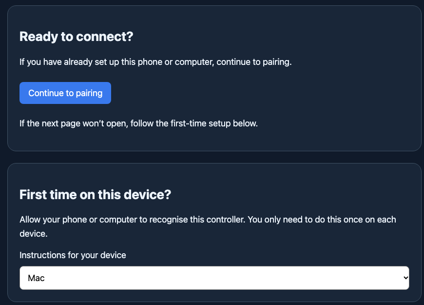
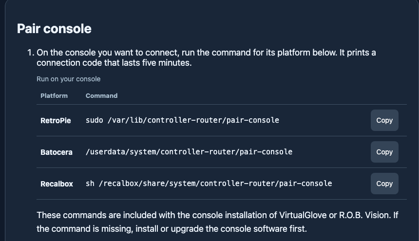
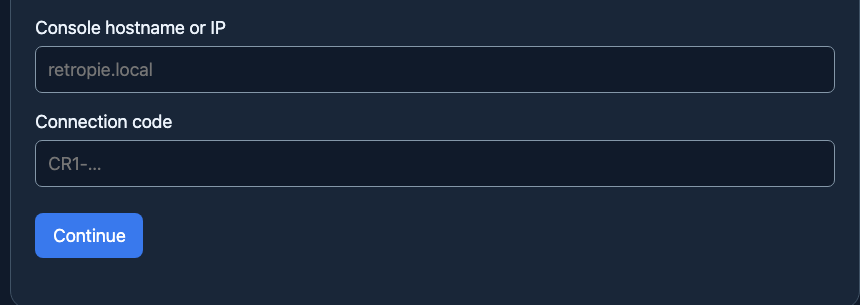
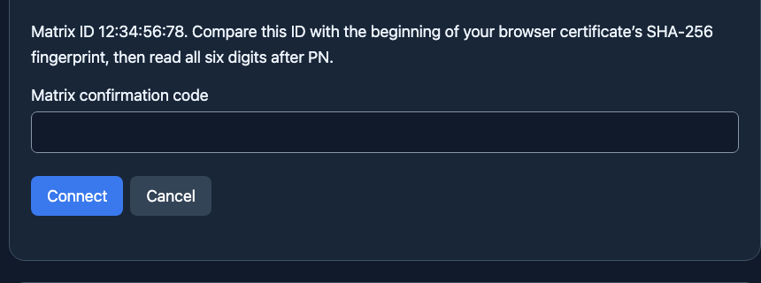
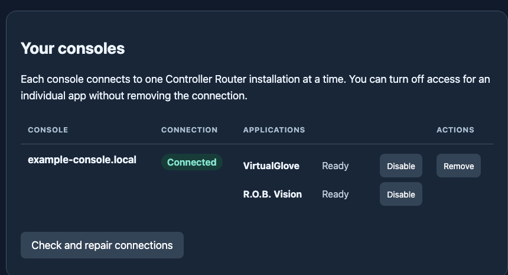

# Connect your console

Pair a console once through Controller Router. VirtualGlove and R.O.B. Vision use the saved connection when each app is installed on both devices. If you install the second app later, Router can add its access without pairing the console again.

Finish any game before pairing. Keep the console and controller on the same local network. A console can be linked to one Controller Router installation at a time; moving it to another controller requires a new pairing.

The screenshots below show the current pages with example values. Do not use the example hostname or Matrix ID as your own.

## 1. Open Pair console

Open your controller's address in a browser and choose **Pair console** from **Apps**. You can also use the pairing button on either product's Setup page. If only one product is installed, its page opens directly; use its pairing button.

The Pair console link first opens a certificate setup page. Choose **Continue to pairing** if this phone or computer already trusts the controller. Otherwise, choose your device under **First time on this device?** and follow its steps. The secure pairing form opens on HTTPS port **8444**.

The controller installer prints a certificate fingerprint. Check it against your browser's certificate details before trusting the local certificate. The **Connection details** section on the first page also shows the fingerprint. Stop if they differ.

## 2. Get a connection code on the console

On the console you want to pair, run the command for its platform. The Pair console page has a **Copy** button beside each command:

- **RetroPie:** `sudo /var/lib/controller-router/pair-console`
- **Batocera:** `/userdata/system/controller-router/pair-console`
- **Recalbox:** `sh /recalbox/share/system/controller-router/pair-console`

The console prints one complete **CR1 connection code**. It works once and expires after five minutes. If the command is missing, install or upgrade the console software first. You do not enter an SSH username or password on the pairing page.

## 3. Enter the console and code

On the secure Pair console page, enter the console's `.local` hostname or LAN IP address in **Console hostname or IP**. Paste the entire CR1 code in **Connection code**, then choose **Continue**.

If the console cannot be found by name, use its LAN IP address. If the code is rejected or has expired, run the console pairing command again to open a new window.

<!-- pagebreak -->

## 4. Confirm on the Matrix display

After **Continue** succeeds, the Matrix display shows **PN**, then three digits, then three more digits. Enter all six digits in **Matrix confirmation code** and choose **Connect**. The sequence repeats for two minutes. The code is not shown before Continue succeeds.

The page also shows a **Matrix ID**. Compare it with the ID shown on the Matrix and the beginning of the verified certificate fingerprint. If they disagree, choose **Cancel** and check which controller you opened.

## 5. Check the connection

Wait for **Connected. You’re ready to play.** The **Your consoles** table then shows the console's connection state and each installed app's readiness. This example uses a sample hostname; your own console and apps may differ.

**Connected** means Router verified the console connection. Each application's **Ready** state is separate. If one app needs attention, choose **Check and repair connections**. A game can select its registered app automatically; you do not have to keep the pairing page open.

## Manage or repair a connection

Return to **Pair console > Your consoles** whenever you need to check a link:

- **Unavailable** means Router could not reach the console. Check that it is on and on the same network, then choose **Check and repair connections**.
- **Needs attention** means the console identity, certificate, or app setup needs review. Check the message, then repair or pair again as directed.
- **Disable** turns off one app's access while keeping the console linked. **Enable** restores it. **Remove** deletes the console connection and its app access.

Finish any game before changing access or removing a console. To add another console, run its pairing command and repeat the steps above. Existing game filenames and player assignments stay saved.

## If the secure page will not open

Open **Pair console** again from Apps or a product's Setup page. The certificate setup page on port 80 offers device-specific instructions:

- **iPhone or iPad:** choose **Set up iPhone or iPad**. Install the downloaded profile in **Settings > Profile Downloaded** or **Settings > General > VPN & Device Management**. Then enable full trust in **Settings > General > About > Certificate Trust Settings**.
- **Mac:** choose **Set up this Mac**, open the downloaded certificate in Keychain Access, and set its **Secure Sockets Layer (SSL)** trust to **Always Trust**. Quit and reopen Safari.
- **Other devices:** follow the browser's local-certificate prompt. If it offers no way to continue, use the public certificate download on the setup page and import it into your device's trusted certificates.

Verify the certificate fingerprint before trusting it. Do not enter a connection code on a page with an unverified or mismatched certificate. Enter codes and Matrix digits only on secure Setup at port **8444**.

## If a code or confirmation fails

Run the console pairing command again if the CR1 code expired, was already used, or was entered incorrectly. Five incorrect code or Matrix attempts lock the current pairing window. If the Matrix sequence expires, start a new pairing window and choose **Continue** again. If a game is running, exit it before retrying.

If a console's certificate has changed, pair it again rather than accepting the mismatch. A saved console can show **Unavailable** while it is powered off; this does not erase its connection.
