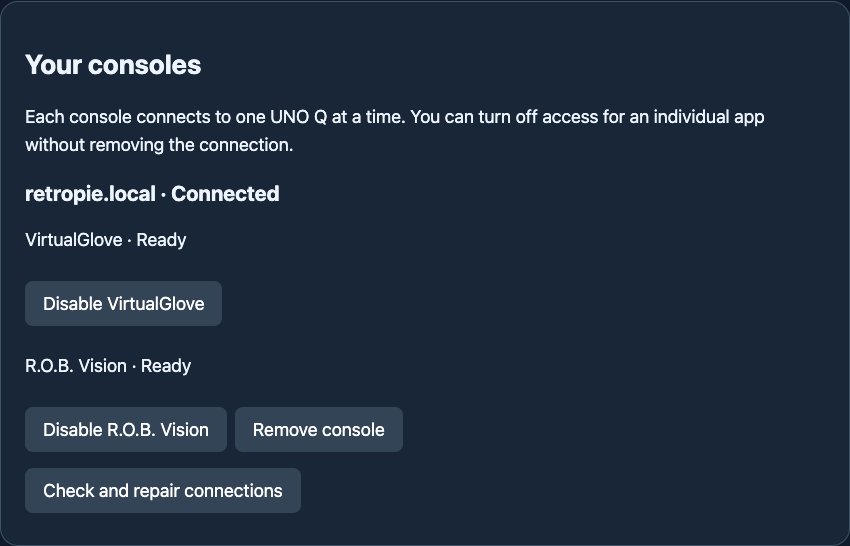

# Pair your UNO Q and console

Pair once for the UNO Q and console. VirtualGlove and R.O.B. Vision receive their own private credentials automatically when installed on both devices. Installing the other app later adds its access without another pairing. No SSH username or password is required.

Finish the game before pairing, changing app access, or removing a connection. Each console connects to one UNO Q at a time. Connecting it to another requires a new console code and Matrix confirmation.

## Connect

After installing either controller product on a Recalbox console, run
`sh /recalbox/share/system/controller-router/pair-console` in its terminal to
open a fresh five-minute connection window. The Router Pair console page lists
the matching commands for RetroPie and Batocera too.

1. Open **Apps > Setup > Pair console**. Both product Setup pages have an **Open Pair console** link to this same page.
2. Open the secure address printed by the UNO Q installer, using its `.local` name or LAN IP. Pairing uses HTTPS port **8444**.
3. Before accepting the local certificate, compare the browser's SHA-256 fingerprint with the fingerprint printed by the UNO Q installer. During confirmation, its beginning also appears after **ID** on the Matrix. Stop if they differ.
4. Enter the console hostname or IP address and paste its complete **CR1 connection code**. The console installer prints this single-use code; it lasts five minutes.
5. Choose **Continue**, read the six Matrix digits after **PN**, and enter them within two minutes.
6. Choose **Connect**. Wait for **Connected** and check each app's readiness below it.

### Check or repair a connection

Open **Pair console > Your consoles**. **Connected** means Router has verified the console connection. **Unavailable** means it could not reach the console. **Needs attention** means the certificate, identity, or app setup needs review. App readiness is shown separately.

Choose **Check and repair connections** after reconnecting a device or installing another app. Use **Disable** beside an app to remove only its access, or **Remove console** to remove the whole connection. Finish any game first. A certificate change requires a fresh pairing; do not ignore the mismatch.

For another code, rerun the console installer or its pairing command. Existing game filenames and player assignments remain saved. Incorrect, expired, or already-used codes require a new window; five incorrect Matrix confirmations lock the current window.

### Trust the local certificate

On iPhone or iPad, download the certificate profile from the certificate setup screen. Install it under **Settings > Profile Downloaded**, then enable it under **Settings > General > About > Certificate Trust Settings** before opening secure Setup. Verify the fingerprint against the installer first.

If your browser leaves secure Setup blank or rejects the local certificate, open **Pair console** from Apps or either product’s Setup page. The certificate setup screen opens on port 80 and provides certificate downloads and instructions for your device. Pairing codes and Matrix confirmation are still entered only on HTTPS port 8444.

The first visit may show a browser certificate warning because the UNO Q uses its own local certificate. Open the certificate details and compare its SHA-256 fingerprint with the UNO Q installer before continuing. After that check, download the certificate from **Trust this Setup page**. Import it into your computer or phone’s trusted certificate settings if you want to avoid repeat warnings. Private-network browser policies vary; accepting this verified local certificate for the visit also works.

## Open the UNO Q address

With one controller app installed, the address opens that app. Before pairing, use its Pair console link to finish setup. With both apps installed, the address shows Apps; both use the same saved connection. Registered games select their app automatically, whether or not a browser is open.
