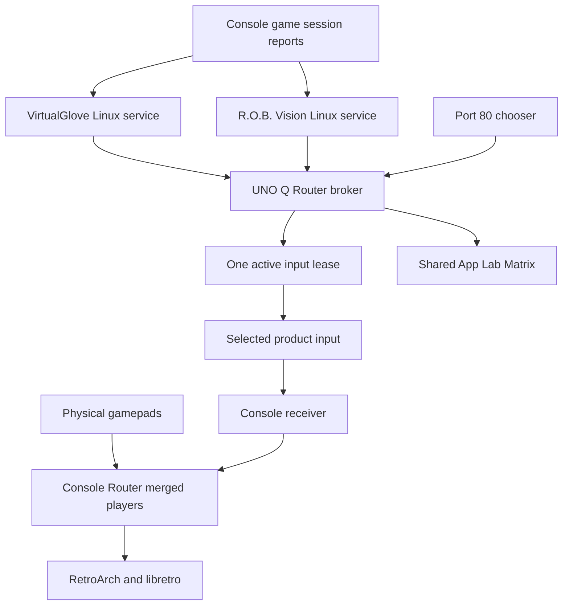

# Controller Router Technical Reference

Controller Router contains two related systems: a console input-routing library and a UNO Q service for app selection, input ownership, and Matrix display. This reference describes the current source rather than asserting that every published product release includes it.

## Architecture and responsibilities



The diagram's session reports are the products' existing authenticated console notifications and heartbeats. Router reads the resulting local service state; the chooser does not infer game selection from which browser tab is open.

| Component | Responsibility | Main source |
| --- | --- | --- |
| Console engine | Import mappings, combine inputs, apply player outputs | `router_shared/controller_router.py` |
| Persistent writes | Atomic replacement and ownership preservation | `router_shared/storage.py` |
| Device-index discovery | Translate Linux devices into RetroArch udev slots | `router_shared/retroarch_udev.py` |
| Source descriptors | Describe fixed virtual controller controls | `router_shared/virtual_sources.py` |
| UNO broker and selection | Read product state, serialize requests, grant leases | `uno_portal/host/broker.py`, `concurrent.py` |
| Product lifecycle | Start both Linux services | `uno_portal/host/products.py` |
| Display scheduler | Validate, schedule, deliver Matrix frames | `uno_portal/host/display_runtime.py` |
| Shared firmware | Render the 13 by 8 Matrix and idle animation | `uno_portal/app/sketch/sketch.ino` |
| Browser chooser | Show installed products and request selection | `uno_portal/python/` |

Pairing protocols, ROM registries, game-specific actions, and Setup assignment controls belong to the products. Buddy's Player 2 configuration is a R.O.B. Vision adapter responsibility; VirtualGlove chooses its gesture player in its own adapter.

<!-- pagebreak -->

## Network and process boundaries

| Port or endpoint | Purpose | Exposure |
| --- | --- | --- |
| TCP 80 | Router entry page and selection API | Trusted LAN |
| TCP 8100 | VirtualGlove browser | Trusted LAN |
| TCP 8101 | R.O.B. Vision browser | Trusted LAN |
| TCP 8443 | VirtualGlove secure Setup and pairing | Existing product service |
| TCP 8766 | R.O.B. Vision console API | Existing product service |
| TCP 8123 | Shared Matrix health and frame delivery | UNO Q loopback |
| `control.sock` | Host broker requests | User-owned local Unix socket |

The socket is `/run/user/1000/controller-router-portal/control.sock`. The port-80 web container forwards fixed requests through a private Compose bridge; it has no general shell-command API. Containers run as UID 1000 with read-only filesystems, dropped capabilities, and no new privileges.

The chooser exposes `GET /api/state` and `POST /api/select`. Selection requires JSON, a bounded request body, and a recognized app. Cross-site browser requests are rejected; same-host product origins on ports 8100 and 8101 are permitted for direct-visit selection. LAN browser selection has no user token and relies on the trusted-network deployment model. Console authentication remains in the products.

A single installed product is selected and opened by the entry page. With two, the chooser stays visible until a choice. With no products, it cannot redirect to a controller. Neither chooser path starts or stops product services.

<!-- pagebreak -->

## Game selection and input leases

Router reads VirtualGlove's `/status` for `worker_running` and `game_session_active`. R.O.B. Vision's `/api/state` supplies `live_game_active`. These are product-managed session states, not unauthenticated claims accepted directly from the chooser.

1. Boot initializes selection to none and writes inactive leases.
2. Exactly one healthy live session selects its product automatically.
3. Previous leases are revoked before changing ownership. When replacing an owner, Router waits 800 ms for the receiver watchdog to neutralize old input.
4. The new owner receives a renewable lease and Matrix selection.
5. Ending a game-owned session revokes input and returns selection to neutral.
6. If both products report live games, Router revokes both leases and reports the conflict.
7. A failed selected service loses its ownership. Manual selection also requires healthy product and Matrix services and rejects a change during a live game.

Manual selection remains selected until another choice, service failure, or game reconciliation changes it; it is not a saved boot preference.

Each product data directory contains `controller-router-lease.json` and the `controller-router-required` marker. A lease has schema 1, the current Linux `boot_id`, an `active` boolean, and a monotonic `until` timestamp. The selected lease lasts two seconds. The heartbeat sleeps 250 ms between reconciliations; HTTP health requests and switching waits can lengthen that interval, so it is not a guaranteed 4 Hz schedule.

Managed products reject missing, malformed, revoked, expired, and previous-boot leases. Their receivers must release input when the product stops supplying it. Product watchdogs complete this boundary; reading an active lease alone is not enough to implement a new receiver safely.

R.O.B. Vision retains pending frame actions for up to 12 seconds while waiting for ownership and retries delivery approximately every 200 ms. It rejects stale or mismatched game/process actions. That queue is product behavior, not part of the generic Router API.

<!-- pagebreak -->

## Matrix manifests and request protocol

Apps are identified as `virtualglove` and `rob_vision`. Their animation manifests use schema 1 and must identify the same app. A manifest contains named animations, each with a boolean `loop` and a sequence of frames.

| Field or bound | Accepted value |
| --- | --- |
| Animation count | 1 to 64 |
| Animation name | Up to 48 alphanumeric or underscore characters |
| Frames per animation | 1 to 128 |
| Frame duration `ms` | Integer, 50 to 5000 |
| Frame rows | Eight strings, each 13 characters long |
| Pixel values | Characters `0` through `7`; eight grayscale levels |
| Manifest file | At most 1 MB; symlinks rejected |

Example of a complete single-frame manifest:

```json
{
  "schema": 1,
  "app": "rob_vision",
  "animations": {
    "demo_dot": {
      "loop": true,
      "frames": [{
        "ms": 200,
        "rows": [
          "0000000000000", "0000000000000",
          "0000000000000", "0000007000000",
          "0000000000000", "0000000000000",
          "0000000000000", "0000000000000"
        ]
      }]
    }
  }
}
```

The local client sends newline-delimited JSON over the Unix socket. `uno_portal/client.py` bounds encoded requests to 1024 bytes and reads responses up to 4096 bytes. A named-animation request is wrapped as follows:

```json
{
  "action": "display",
  "request": {
    "version": 1,
    "app": "rob_vision",
    "action": "play",
    "animation": "demo_dot"
  }
}
```

A product should use `display(app, action, **details)` rather than inventing its own transport. `lease(app)` queries current ownership. Display acceptance confirms validation and ownership; it does not by itself prove physical delivery. Matrix status includes a separate recent-delivery result and error.

<!-- pagebreak -->

## Display timing and failure behavior

| Action | Behavior |
| --- | --- |
| `play` | Play a manifest animation; identical refreshes keep its position |
| `status` | Show one to three supported characters |
| `pairing` | Cycle identity and six-digit PIN fragments |
| `clear` | Remove the app request and allow neutral firmware display |

Status characters are restricted to `0123456789ABCDEFINP`. Pairing needs a seven-character uppercase hexadecimal identity and six numeric PIN digits. The sequence is ID, three identity characters, three more, the final identity character, PN, and two three-digit PIN groups, each shown for 900 ms.

Only the selected app can submit a display. Pairing displays are rejected during a live game. Play and status requests expire after five seconds without refresh. Pairing display expires after 120 seconds. Clearing selection removes the pending request.

The scheduler checks frames every 50 ms. An unchanged frame is refreshed at least every 800 ms while a request is active. The firmware returns to its neutral animation after 1800 ms without a delivered frame. These are configured intervals; network and scheduler delays can affect actual display timing.

## Console routing and persistent state

EmulationStation provides the authoritative physical-controller mappings. Router imports stable identities and maps buttons, axes, and hats into Player 1-4 state. Known fixed virtual pads can be described by a schema-1 source descriptor. A source descriptor describes controls; it does not assign a player.

The assignment document uses format version 2. It stores platform, players and their source mappings, the gesture player where applicable, and physical routing scope. The existing `virtualglove_player` field and `VirtualGlove Merged Player N` output names are retained for compatibility.

`RouterStore` returns inventory, a document revision, and backup availability. A save resolves source IDs against authoritative discovered or saved mappings, checks the revision, validates the result, and keeps the previous document for rollback. Reconfiguration is blocked while any Libretro game is active. Product Setup provides the web controls; the library provides storage and routing.

| Platform | Default assignment document |
| --- | --- |
| RetroPie | `/etc/virtualglove/controller-router.json` |
| Batocera | `/userdata/system/virtualglove/data/controller-router.json` |
| Recalbox | `/recalbox/share/system/virtualglove/data/controller-router.json` |

Product adapters can pass explicit configuration paths. Read the installed adapter and service before assuming a default. A `.previous` sibling stores the last assignment backup.

Router resolves merged outputs by their unique names and vendor/product IDs immediately before RetroArch executes. Its udev slot differs from Linux `jsN` numbering. `prepare-launch` waits up to five seconds and rejects missing or duplicate identities. It writes a temporary session file; runtime routing never edits saved `retroarch.cfg` files. Assignment changes save Router's own configuration and take effect on the next launch.

Atomic writes create a temporary sibling, flush and sync it, then replace the target. Existing permissions and ownership are retained; writes as root under `/opt/retropie/configs/` explicitly assign `pi:pi`. Product receivers and wrapped-game launchers must not separately rewrite those player assignments.

<!-- pagebreak -->

## Assignment API: a new project

`RouterStore` is the local assignment API. Instantiate it with your configuration path, detected platform, and EmulationStation input file. Your authenticated web or CLI adapter calls `operate()`; clients do not write the assignment document directly.

```python
from pathlib import Path
from router_shared.controller_router import RouterStore

store = RouterStore(
    Path("/var/lib/my-controller/controller-router.json"),
    "retropie",
    Path("/opt/retropie/configs/all/emulationstation/es_input.cfg"),
)
state = store.operate("read", {})
```

Read returns `config`, `revision`, `has_backup`, and `inventory`. Inventory supplies authoritative source IDs. A save proposal contains source IDs rather than accepting event mappings supplied by an untrusted browser.

```python
proposal = {
    "players": [{"player": 1, "sources": [chosen_source_id]}],
    "virtualglove_player": None,
}
updated = store.operate("save", {
    "revision": state["revision"],
    "config": proposal,
})
```

Here `chosen_source_id` must come from the returned inventory. This intentionally minimal proposal assigns one source to Player 1. For an existing installation, construct the proposal from every current player's source IDs, changing only the requested assignment; otherwise omitted assignments are removed.

| Operation | Payload | Result or failure |
| --- | --- | --- |
| `read`, `inventory` | Empty object | Configuration, revision, inventory, backup flag |
| `check` | Optional `watch_ms` | Missing sources, enabled players, activity, safety result |
| `save` | `revision`, proposed `config` | Validated persisted state; rejects active game or stale revision |
| `rollback` | `revision` | Restored previous snapshot; rejects missing backup or active game |

The store does not authenticate HTTP or start a Router process by itself. Supply an `activate` callback if a successful save must activate your service. Activation failure restores the prior assignment document. Platform files and the running input engine remain integration responsibilities.

Source: [RouterStore and operations](https://github.com/mathan416/Controller-Router/blob/dev/router_shared/controller_router.py).

<!-- pagebreak -->

## Input-engine API and custom sources

`ControllerRouterDevice` owns the merged uinput outputs. Pass a complete saved configuration and explicit platform paths. Close it during service shutdown to neutralize outputs and release devices.

```python
from pathlib import Path
from router_shared.controller_router import ControllerRouterDevice

engine = ControllerRouterDevice(
    config_path=Path("/var/lib/my-controller/controller-router.json"),
    retroarch_config=Path("/path/chosen/by/your/platform/adapter.cfg"),
    es_inputs=Path("/path/to/es_input.cfg"),
)
# Run your service event loop here.
# In its shutdown/finally handler:
engine.close()
```

These paths are illustrative and must be chosen by your installer. The library can update managed emulator mapping files, so test with isolated configuration before pointing a prototype at a live console. A Linux service needs access to its source devices and uinput; the assignment store alone does not create controllers.

For a fixed virtual gamepad, `configured_sources(path)` validates a schema-1 source descriptor. The file allows up to 16 sources and is limited to 65536 bytes. Each source has exactly `name`, `vendor`, `product`, and `mapping`; each mapping entry has `name`, `type`, `code`, `value`, and `evdev_code`. Vendor/product are four hexadecimal characters. Mapping types are button, axis, or hat. Use the Integration Guide's descriptor as a starting point.

For the existing gesture socket, the engine uses local Unix datagrams, not an authenticated network endpoint. `virtual_state()` accepts boolean D-pad values, boolean buttons `a`, `b`, `start`, `select`, `glove_zap`, and integer axes `x`, `y`, `z`, `roll` in -32767 through 32767. Datagram payloads are bounded to 8192 bytes. Virtual state has a 500 ms stale timeout.

The `virtualglove_player` configuration field chooses the gesture stream's player. Delivery is additionally gated by recognized joystick cores in the current engine. Native hand data takes a separate product path. To support arbitrary new game/core combinations, review and extend this gating with tests, or use the fixed uinput source path instead.

Sources: [input engine](https://github.com/mathan416/Controller-Router/blob/dev/router_shared/controller_router.py), [source descriptor validation](https://github.com/mathan416/Controller-Router/blob/dev/router_shared/virtual_sources.py), and [gesture state contract](https://github.com/mathan416/Controller-Router/blob/dev/router_shared/merged_gamepad.py).

<!-- pagebreak -->

## Product adapters as API examples

### R.O.B. Vision: project policy around a shared store

`tools/controller_router_setup.py` discovers Buddy's fixed pad, retains existing assignments, and adds it to Player 2. `tools/game_registry.py` authenticates its console `/router` request, checks that Buddy remains on Player 2, and delegates the requested operation to `RouterStore.operate()`.

This is the pattern for a new project with a fixed player requirement: enforce the game-specific policy in the adapter while sharing inventory, revisions, storage, and rollback. Do not fork the engine simply to reserve a player.

The Matrix adapter uses the shared client under the product's vendored namespace:

```python
from controller_router_portal.client import display

display("rob_vision", "play", animation="gyromite")
display("rob_vision", "clear")
```

These requests work only while R.O.B. Vision owns selection and its manifest defines the animation. Returning `accepted` is distinct from confirmed recent Matrix delivery.

Sources: [Buddy assignment policy](https://github.com/mathan416/ROB-Vision/blob/dev/tools/controller_router_setup.py), [authenticated Router endpoint](https://github.com/mathan416/ROB-Vision/blob/dev/tools/game_registry.py), and [R.O.B. Vision Matrix calls](https://github.com/mathan416/ROB-Vision/blob/dev/controller/matrix.py).

### VirtualGlove: authenticated transport around the same API

`src/virtualglove/controller_router.py` re-exports the shared engine for compatibility. Its `RouterService.exchange()` implements `virtualglove-inputs/1`, validates signed messages, consumes a one-use challenge with a 15-second expiry, then calls `store.operate()` and signs the response. `router_request()` handles the paired console exchange.

A new project should reuse `RouterStore` and supply its own authenticated transport rather than copying VirtualGlove's pairing assumptions. Bound requests, correlate responses, reject replay, and keep secrets out of returned inventory.

The display adapter uses the same client API:

```python
from controller_router_portal.client import display

display("virtualglove", "play", animation=profile_animation_name)
display("virtualglove", "clear")
```

`profile_animation_name` is selected by VirtualGlove and must exist in its manifest. The adapter can also request a pairing identity and PIN; Router validates that display and rejects it during a live game.

Sources: [VirtualGlove API facade and authentication](https://github.com/mathan416/VirtualGlove/blob/dev/src/virtualglove/controller_router.py) and [VirtualGlove Matrix calls](https://github.com/mathan416/VirtualGlove/blob/dev/src/virtualglove/matrix.py).

<!-- pagebreak -->

## Packaging and extension

`router_shared` is a dependency-free Python console library. The wheel contains Python and license files, not CPU-specific binaries, so it does not need a separate wheel per processor architecture. `pyproject.toml` declares Python 3.10 or newer for that standalone package. UNO Q launcher assets are bundled separately; installing the wheel alone does not install App Lab firmware, services, or browser assets. Product emulator wrappers have their own architecture requirements.

The shared source is vendored into both products. To verify copies without changing them:

```sh
python3 scripts/sync.py --check --virtualglove /path/to/PowerGlove
```

To publish shared changes into local product checkouts:

```sh
python3 scripts/sync.py --virtualglove /path/to/PowerGlove
```

The R.O.B. Vision checkout defaults to the sibling `rob-vision`; use `--rob-vision` for another location. Sync includes `router_shared` and UNO portal assets. Do not edit product copies independently. Product pairing and game actions remain in their adapters.

A future controller can reuse the console library with a source descriptor, assignment adapter, receiver, and Setup interface. Adding a third UNO Q app also requires explicit changes to the portal's allowed-app lists, health endpoints, installer registration, and manifests. The current UNO portal is not a plugin discovery system.

## Verification and known limitations

Run the shared repository tests:

```sh
python3 -m unittest discover -s tests
```

The suites exercise library storage and mappings, portal selection and browser protections, leases, shared display validation and scheduling, and installer behavior. Mocked tests verify contracts; live tests verify the device and emulator boundary.

For a release candidate, record both install orders, repeat upgrades, one-app redirects, two-app chooser behavior, no-selection reboot, automatic game selection, first input, exit, manual-switch rejection, service loss, display expiry, and pairing. Verify preserved registry and assignment data and RetroPie ownership. Test each product's supported consoles and emulator cores separately.

The live uinput reconnect regression passed on RetroArch 1.19.1 and the separate 1.20.0 test build. Physical wireless-controller endurance testing remains a release check. Keep merged outputs alive throughout a game; if the Router process loses them, report the failure and require relaunch. See `docs/ROUTING_VALIDATION.md` for the evidence and its limits.

One selected app owns a UNO Q game at a time. The current system does not combine VirtualGlove's gestures and Buddy's game input simultaneously. Console merging within the selected product and physical sources remains available. Pairing and platform-specific support are controlled by the products, not extended merely because this library recognizes a platform.


## RetroArch compatibility and launch routing

`router_shared.launch` owns session routing. `router_shared.launch_install` registers the integration during installation or upgrade and backs up replaced files. Both products bundle the same modules.

| Mode | Selection | Behaviour |
| --- | --- | --- |
| Legacy udev | Installed RetroArch 1.19.1 and unknown builds | Resolve name plus VID/PID into the current udev slot immediately before execution. |
| Native reservations | RetroArch 1.20.0 or newer with both reservation keys present in the selected executable | Set each unique merged name as a strict reservation (`device_reservation_type = 2`), with VID/PID independently validated during discovery. |

Reservation strings use the unique name. RetroArch treats a VID/PID-prefixed reservation as a match on VID/PID alone; combining that prefix with a name would not validate both fields. The adapter still sets the initial numeric slot for diagnostics and startup consistency. For native reservations, it seeds a complete permutation of all 16 initial indexes, preserving the configured merged outputs. RetroArch 1.20.0 can crash in its reservation allocator when duplicate initial indexes leave holes in its inverse map; the temporary permutation prevents that failure.

On RetroPie, the installer wraps existing RetroArch commands in `emulators.cfg`. Environment assignments, core arguments, ROM arguments, native hand-input options, cabinet hooks, and existing appended files remain in place. The adapter adds its temporary configuration last in the append chain. The selected executable remains unchanged. PSP and other ordinary Libretro games use the same path. If Router is not configured, the adapter passes the command through.

On Batocera, the installer validates the Libretro generator's final command boundary and installs a narrow module overlay. It adds the adapter after generation, before execution. Game-start hooks only report sessions: they run before configgen and cannot supply reliable final routing. Unsupported generator layouts stop installation rather than guessing at a patch. The overlay is reapplied at boot against the installed generator so upstream changes are retained.

The root-owned Router configuration stays private. A public runtime manifest at `/run/virtualglove/controller-router-launch.json` contains only enabled output numbers and platform; the unprivileged RetroPie adapter can use it without reading physical source settings or pairing credentials.

### Wireless disconnects and recovery

Merged outputs persist while physical pads sleep, wake, disconnect, or reconnect. Router reconnects each source to its saved player and refreshes frontend mappings between games. It does not recreate the merged outputs during a live game. Idle assignment edits retain existing outputs, keep newly unassigned outputs neutral, and create only newly required players. Diagnostic logs include mode, name, VID/PID, event node, and launch slot.

The adapter forwards termination signals and waits for RetroArch. On Linux, its child also receives a parent-death signal if a frontend forcibly kills the adapter. An unconfigured adapter replaces itself with the original executable, retaining the frontend's normal process lifetime. These paths avoid leaving an emulator running behind a closed launcher.

A process-lifetime ownership lock at `/run/virtualglove/controller-router-owner.lock` prevents concurrent product startup from creating duplicate merged outputs or replacing the shared socket. The lock records the owning process ID for service discovery; the open file lock, not that recorded number alone, grants ownership.

A Router restart removes those persistent devices. The adapter reports that the game must be relaunched, and Router refuses to recreate outputs while RetroArch is playing. End the game, wait for Router to become ready, then relaunch. Recreating devices midway through a legacy session cannot safely recover its original slots.

### Validation scope

Live evidence is recorded in `docs/ROUTING_VALIDATION.md`. Legacy validation targets Linux's udev joypad driver. Do not infer support for another driver or an untested platform version from successful identity resolution alone.

## Per-system routing policy

The format-2 document accepts `physical_scope` values `nes`, `all`, and `systems`. Selected mode stores canonical console IDs in `physical_systems`; an empty list disables routing for every system. Existing documents without a scope retain their released all-system behavior. New configurations start with NES only. Assignment-only saves from older clients preserve the current policy.

The read API includes a `systems` catalogue with ID, display name, and enabled state. System selections use the existing revision-checked save and rollback operations. Discover newly installed systems without enabling them in selected mode.

RetroPie emulator registrations and Batocera configgen pass `--system` to the Router adapter. The adapter supplies `CONTROLLER_ROUTER_SYSTEM` to the RetroArch process; the input service reads that same identity from its process environment. Core names do not distinguish systems sharing an emulator. A compatibility fallback reads the RetroPie system configuration path, or recognizes known NES cores for older NES-only launches. Selected mode with no known system passes through without routing.

Disabled launches preserve the original frontend arguments and add no Router settings. The input service leaves physical sources ungrabbed and does not forward them for that session. Merged output devices remain alive. Global, system, and override RetroArch configurations remain untouched.
