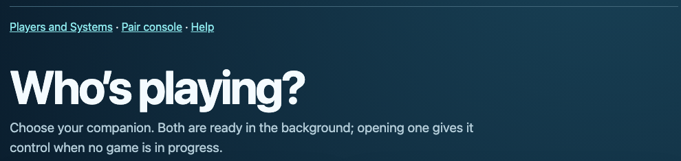
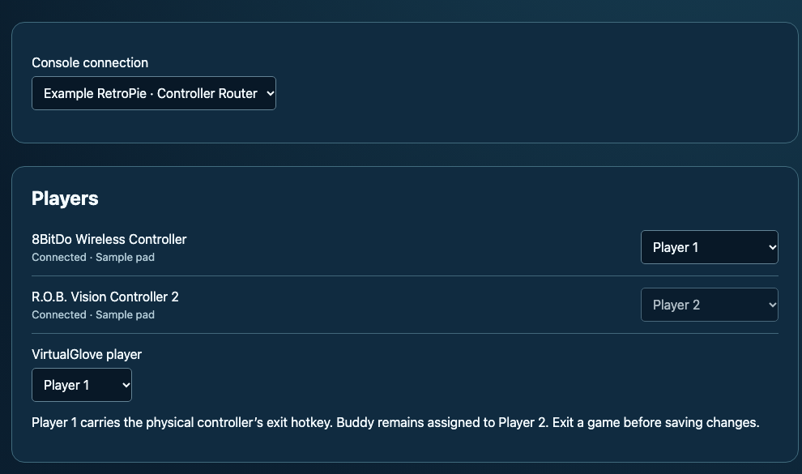
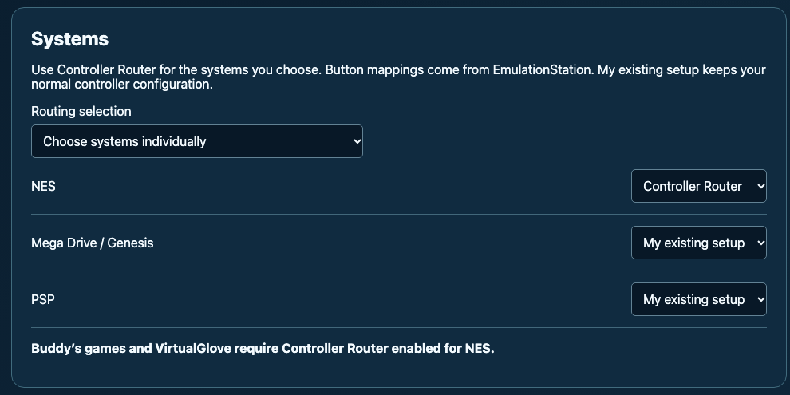
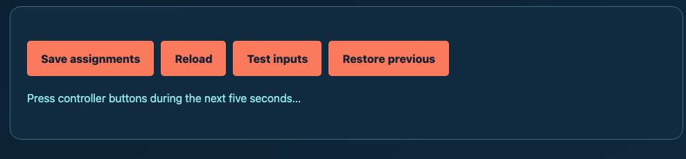
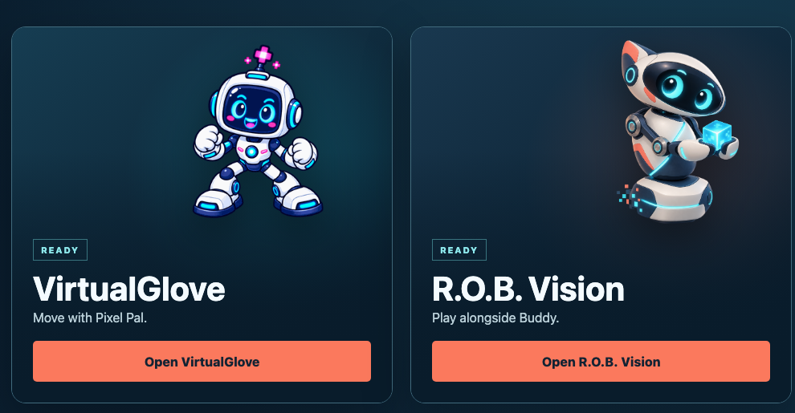

# Controller Router: get your controllers ready to play

Controller Router lets you choose which gamepad controls each player, and which systems use those choices. It also brings VirtualGlove and Buddy together in one place.

Already happy with your controls? Keep your saved choices. You only need this guide when you want to change a player, choose a system, or troubleshoot a pad.

The screenshots use example devices and settings. Your console and gamepads may have different names.

## Open Setup

1. In your browser, open the controller address shown by its installer.
2. Choose **Players and Systems** on the Controller Router page.
3. Select your paired console under **Console connection**.

You will see **Players** first, then **Systems**. Each console keeps its own settings. If no console appears, choose **Pair console** in Router Setup first.

## Choose who plays

Before assigning a gamepad, configure its buttons in EmulationStation, your console's game menu.

1. Exit any running game.
2. In Router **Setup > Players**, find your gamepad by name.
3. Choose **Player 1**, **Player 2**, **Player 3**, or **Player 4**. Choose **Unassigned** if you do not want that pad to join a Router player.
4. If VirtualGlove is installed, choose its gesture player under **VirtualGlove player**, or leave it **Unassigned**.
5. Choose **Save assignments**.
6. Launch a game to try the new choices.

Keep a physical gamepad assigned to **Player 1** for the usual menu and exit controls. Several pads can share one player; a pad can belong to only one player. Buddy stays on **Player 2** for Gyromite's red and blue gates.

A game must support additional players for Player 3 or Player 4 to do anything. Assigning four pads does not turn a two-player game into a four-player game.

## Choose which systems use Router

Want Router for NES but your normal controls for Mega Drive / Genesis? You can choose each system separately.

1. With the game closed, open **Setup > Systems**.
2. Under **Routing selection**, choose **Choose systems individually**.
3. For each listed system, choose one of the following options.
4. Choose **Save assignments**, then launch your next game.

| Choose | What happens in a game |
| --- | --- |
| **Controller Router** | The system uses the player assignments you saved in **Players**, with the buttons you configured in EmulationStation. |
| **My existing setup** | The system uses its normal controller setup. Router adds no player-routing changes for that game. |

**Buddy's games and VirtualGlove require Controller Router enabled for NES.** You can still choose **My existing setup** for NES when you want to use your own controls instead.

New Router setups start with **NES only**. Upgrades keep your choices. **All Libretro systems, including newly added systems** applies Router to every supported RetroArch system. In individual mode, a newly discovered system starts with **My existing setup**.

The list covers systems that offer supported RetroArch emulators. Separate emulators, such as a standalone Amiga emulator, keep their own controls. Your choice also stays saved if a system is temporarily unavailable.

## Check a gamepad

1. In Router Setup, choose **Test inputs**.
2. Press a direction or button on the pad during the next five seconds.
3. Read the result, then repeat for another pad if needed.

**No button presses detected** can simply mean you did not press anything during the test. Try again before changing settings.

| Status | What to do |
| --- | --- |
| Connected | The pad is available. Try **Test inputs** to identify it. |
| Unavailable | Turn on or reconnect the saved pad. If you replaced it, configure and assign the new one. |
| Mapping refreshed or updated | Router found your newer EmulationStation button setup. Exit and relaunch the game to use it. |

**Reload** brings back the saved choices and discards unsaved edits. **Restore previous** restores the preceding saved setup. Exit the game before saving or restoring.

## Start a game or choose an app

Launch a registered game on your paired console. Router selects VirtualGlove or R.O.B. Vision automatically, so you do not need a browser open for the controller to join the game. Only that app supplies game input and display cues. When the game ends, the Matrix returns to its neutral animation.

To open an app yourself, visit the controller address. With one app installed, it opens directly. With both installed, choose VirtualGlove or R.O.B. Vision. **Apps** in either app returns to the chooser; it appears only when both are installed. Finish a game before changing apps manually. Both apps stay available in the background.

After the startup heart, an animated hourglass shows that the controller is still starting. When the installed controller apps are ready, the Matrix shows Router’s neutral animation. After a reboot, the controller waits for a game or your choice. You do not need to reinstall or pair again.

## Get back to your game

**My pad works in the game menu but not in the game.** Try another connected pad: yours may be assigned to Player 2. Exit the game, check **Players**, and use **Test inputs** to identify the pad you want on Player 1. Save and relaunch.

**A wireless pad went to sleep.** Wake it or reconnect it. Router keeps its player controllers connected and returns the pad to its saved player. If the Router service itself restarted, exit and relaunch the game once it is ready.

**My buttons changed after I remapped them.** Exit the game, confirm the new buttons in EmulationStation, and relaunch. Your player assignment stays saved.

**I cannot save.** Finish the running game first. If another page changed the settings, choose **Reload**, make your choices again, and save.

**The wrong app is showing.** Check that the game is registered in the right app and that the console is paired with this controller. Exit the game before making changes.

## More help

For installation and connection steps, see the [Pairing Guide](PAIRING_GUIDE.md). To build a controller integration, start with the [Integration Guide](INTEGRATION_GUIDE.md). API and recovery details are in the [Technical Reference](TECHNICAL_REFERENCE.md).
